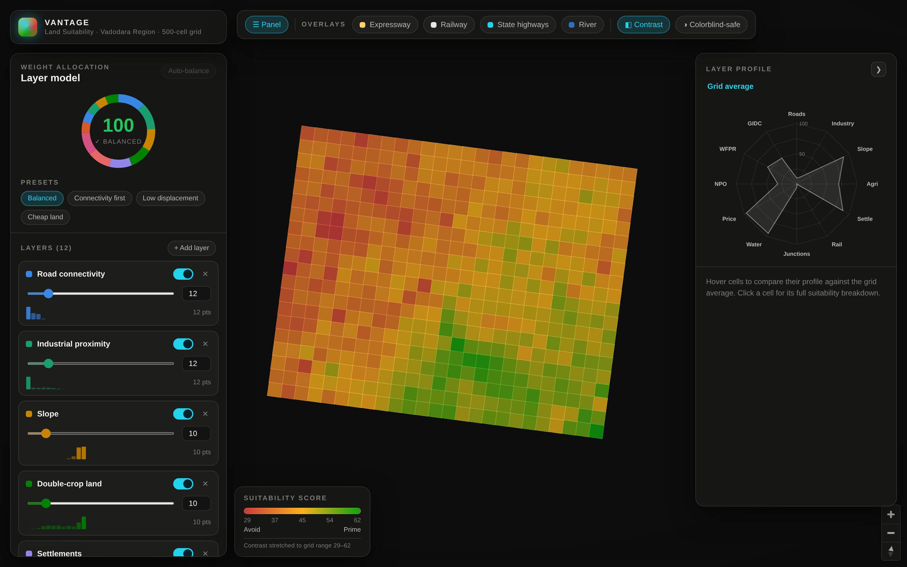

# Vantage — Land Suitability (Vadodara PoC)

An interactive, dark "ops-console" web app that computes a **weighted land-suitability
score** over a 500-cell analysis grid (Vadodara region, Gujarat), renders it as a
red→green heatmap, and — on clicking any cell — erupts a **360° radial 3D column
chart** showing how each layer contributes to that cell's score. Layers are fully
dynamic: add / remove / enable / re-weight, with live validation that weights total 100.



## What's in the box

- **`scripts/build-grid.mjs`** — dependency-free Node preprocessing. Builds a canonical
  500-cell grid from `data/Analysis/Slope.geojson`, joins every analysis layer by
  **nearest cell centroid** (FeatureID is not consistent across layers) and village
  layers by **point-in-polygon** of the cell centroid (2 km nearest-polygon fallback).
  Emits `app/public/data/{grid,scores,catalog}.json` + minified overlays, and prints a
  join-quality report (hard-fails if any grid layer matches < 495/500).
- **`app/`** — Vite + React 18 + TypeScript + zustand + MapLibre GL. Carto Dark Matter
  basemap, feature-state heatmap, the fill-extrusion radial chart, glass control panel
  (weight donut, sliders, presets, add/remove/enable, per-layer score histograms),
  cell inspector, validation error banner with auto-balance / undo, overlay toggles,
  and a CVD-safe blue-ramp toggle.

## How to run

```bash
# 1. (Re)generate the grid data — writes app/public/data/*
node scripts/build-grid.mjs

# 2. Run the app
cd app
npm install
npm run dev        # dev server  →  http://localhost:5173
# or
npm run build && npm run preview   # production build + static preview
```

The preprocessed data is committed, so step 1 is only needed if the source GeoJSON
under `data/` changes.

## Scoring model

```
suitability(cell) = Σ  (wᵢ / 100) · sᵢ(cell)     over enabled layers
```

- `sᵢ ∈ [0,1]` is each layer's precomputed suitability (higher = more suitable).
- Enabled weights **must sum to exactly 100**; any other total is an invalid
  configuration → the map desaturates to gray, the radial chart freezes, and a
  persistent error banner offers **Auto-balance** (proportional rescale, rounding fixed
  so the total is exactly 100) and **Undo**.
- Cells with no data for a layer (e.g. a centroid outside every village polygon) are
  **re-normalized** over the layers that do have data and flagged "partial data".

## Join quality (from the pipeline report)

| Layer group | Result |
|---|---|
| 9 grid layers (roads, industrial, slope, double-crop, settlements, railway, junctions, streams, GIDC) | **500/500** matched, 0 m drift |
| Village NPO / WFPR | 476 / 460 covered (rest re-normalized) |
| Village Jantri | 313 covered — only 53 villages, genuinely spans part of the area |

The GIDC influence layer's source extract is all zero, so the pipeline substitutes
deterministic synthetic demo scores (seeded per cell index); it is enabled by default
with weight 6.

## Design & accessibility

Dark, glassmorphism UI. The 8-slot categorical layer palette is validated with the
`dataviz` skill's `validate_palette.js` (passes; CVD separation sits in the 8–12 floor
band, mitigated by the required **direct labels everywhere** — every sector, card, and
bar names its layer, so identity never rides on color alone). The red→amber→green
suitability ramp is paired with numeric scores in the tooltip/inspector and a
**CVD-safe blue** toggle. `prefers-reduced-motion` is respected.
